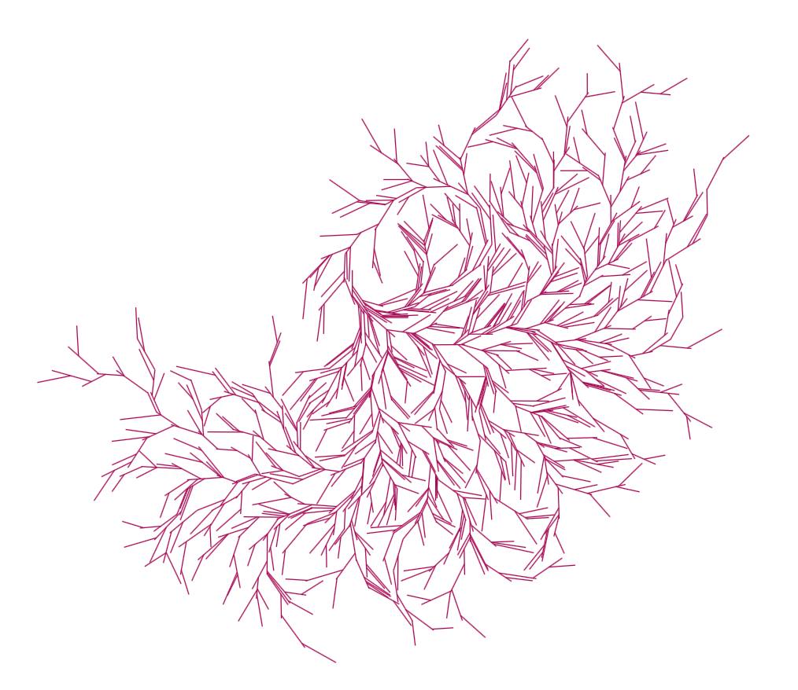
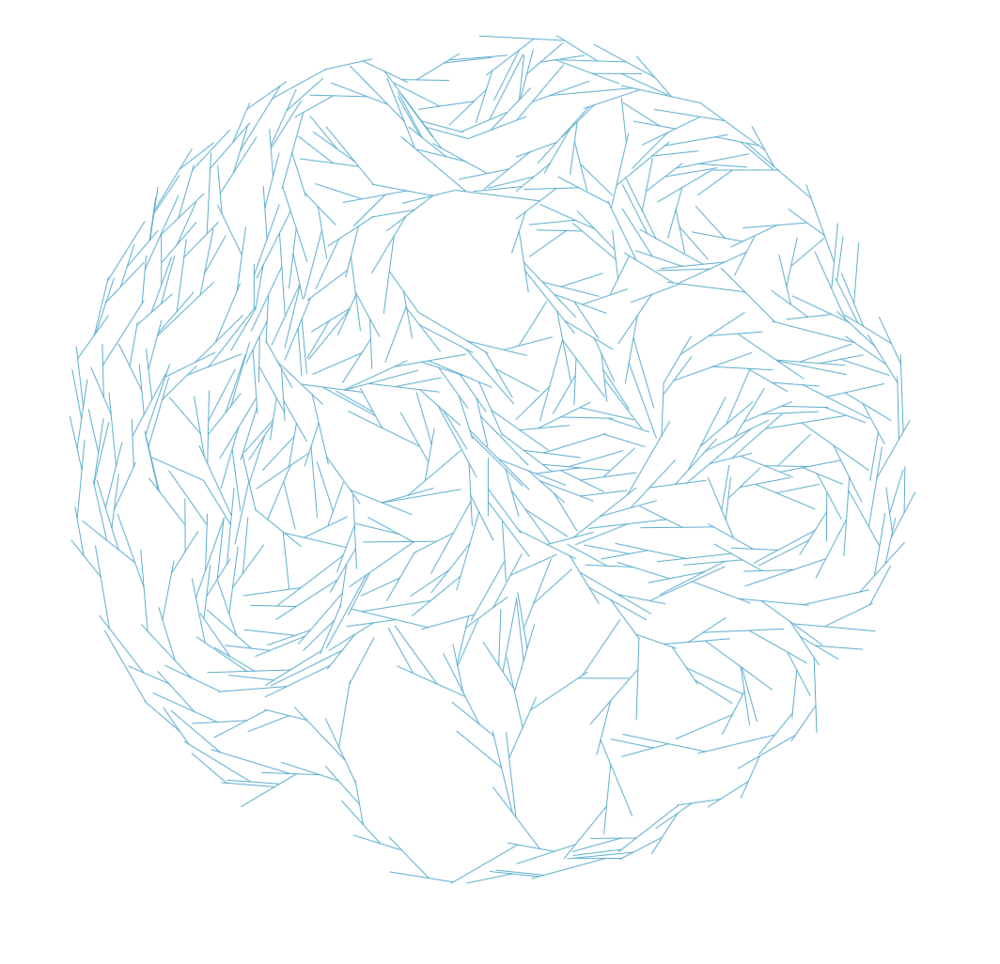

## Python generated patterns for laser cutting

I want to create coasters with a tree pattern to be laser cut. Tree patterns can be parametereized by

 * mean/var branch thickness
 * mean/var branch length
 * mean/var branch angle
 * branch taper (within a branch and over time)
 * center point (where the tree starts)
 * attach at end of branches (bool)

## Examples of generated files

These images are screenshots of svgs generated using `tree_coaster_generator.py`. The svgs are available under `results/test*.svg`

